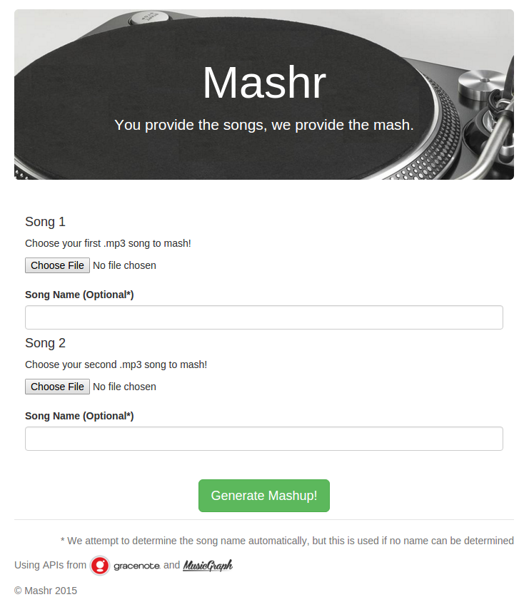

# Mashr
Web application to generate a mashup from two given songs. (Bonus command line utility thrown in in the form of mixupcmd.py).

#### Dependencies
Python dependencies are in the requirements.txt file. Install with `pip install -r requirements.txt`.

You will also need ffmpeg. Ubuntu: `sudo apt-get install ffmpeg`. Mac: `brew install ffmpeg --with-libvorbis --with-ffplay --with-theora`

#### Running
For local development: `python server.py`. For production: `gunicorn server:app -c gunicorn_config.py`

## Samples
Mashr works best with electronic songs of apporximately the same bpm. `samples/earthquakeXfloating.mp3` is a decent mix of `samples/EarthquakeBeatScientist-IMissHer.mp3` and `samples/4PL4Y-Floating.mp3`, while `samples/zeddXglass_lux.mp3` (a cross of `samples/stay_the_night-zedd.mp3` and `samples/im_a_machine-glass_lux.mp3`) is an example of what can go wrong when the song includes lyrics.

## Screenshot!
Isn't it beautiful.

